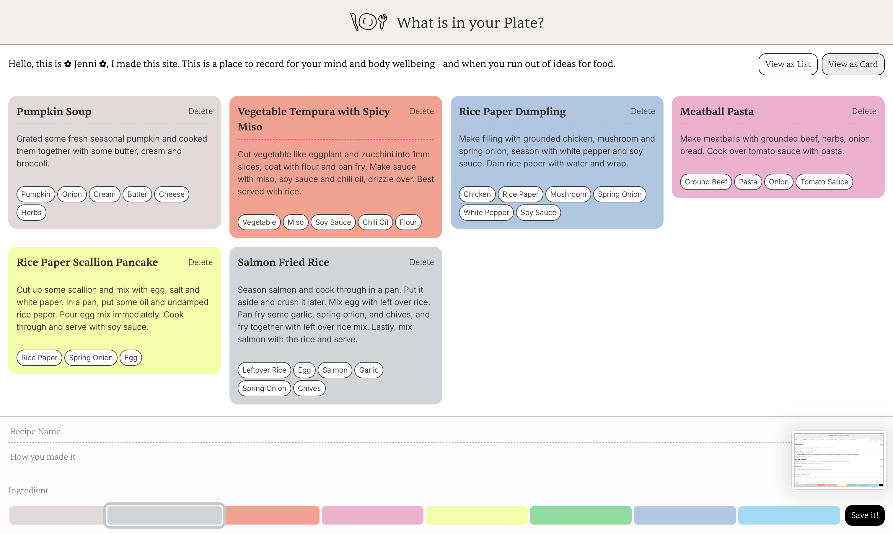
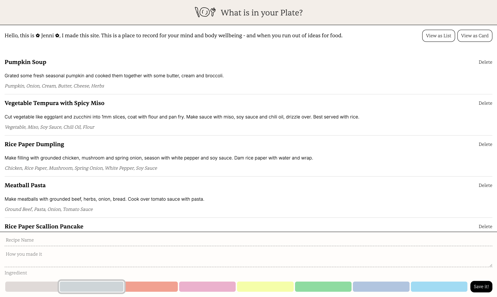

# Assignment 01

## Brief

Starting from the concept of a pinboard, implement a web page that:

- is responsive (properly layout for smartphone, tablet, and desktop)
- allows the user to add and remove elements
- allows the user to coustomize elements (i.e. colors, size)
- allows the switch between two views (at least)

## Submission

### Description

I created a personal recipe tracker designed to record and revisit meals, ingredients, and cooking notes. It lets users switch between card and list views, personalize colors, and visually organize their food memories to inspire future cooking ideas and mindful eating habits.

### Functions

CHANGE VIEW OF THE CARD
- change class of card recipe and list recipe after pressing button.
- Updates all ingredient tag wrappers to match the selected view style. (from chip to text list)

COLOR SELECTION
- Detects which color button is selected.
- Saves the selected color to apply it to the next created recipe card.

ADD CARD
- Creates a new recipe card using the input title, description, and ingredient values.
- Applies the selected background color and inserts the new card into the list.
- Clears input fields after saving.

DELETE CARD
- Removes the selected recipe card when the “Delete” button is pressed.
