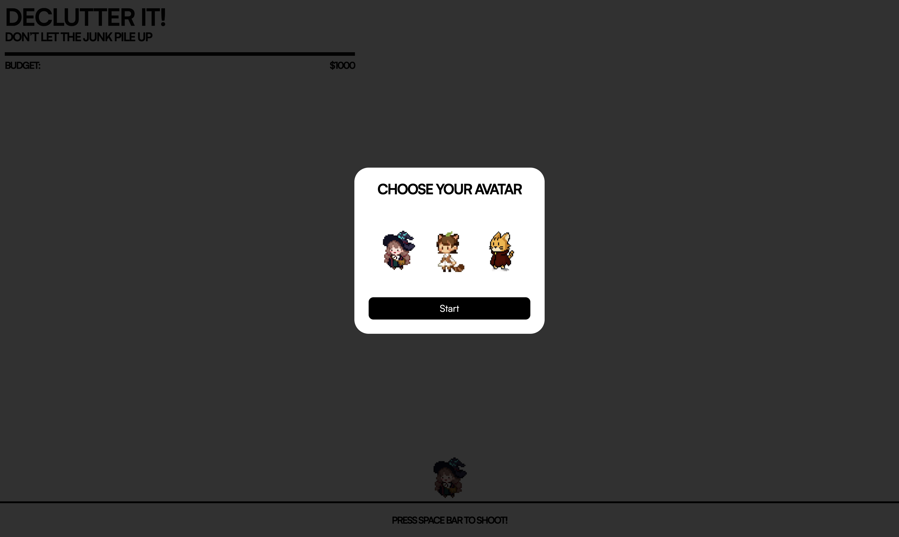
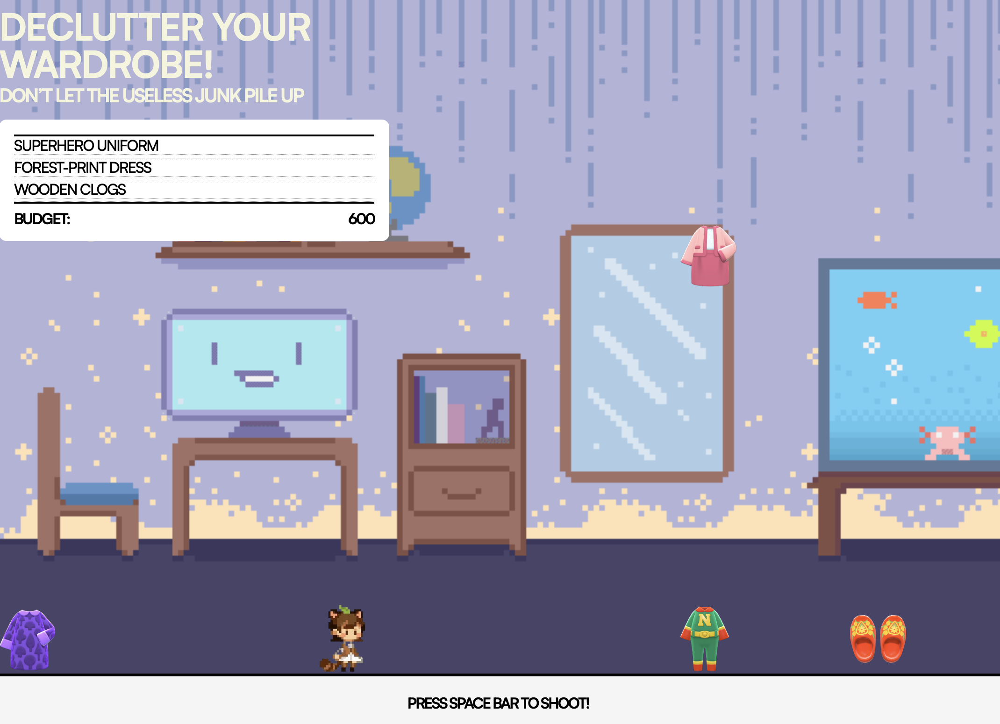
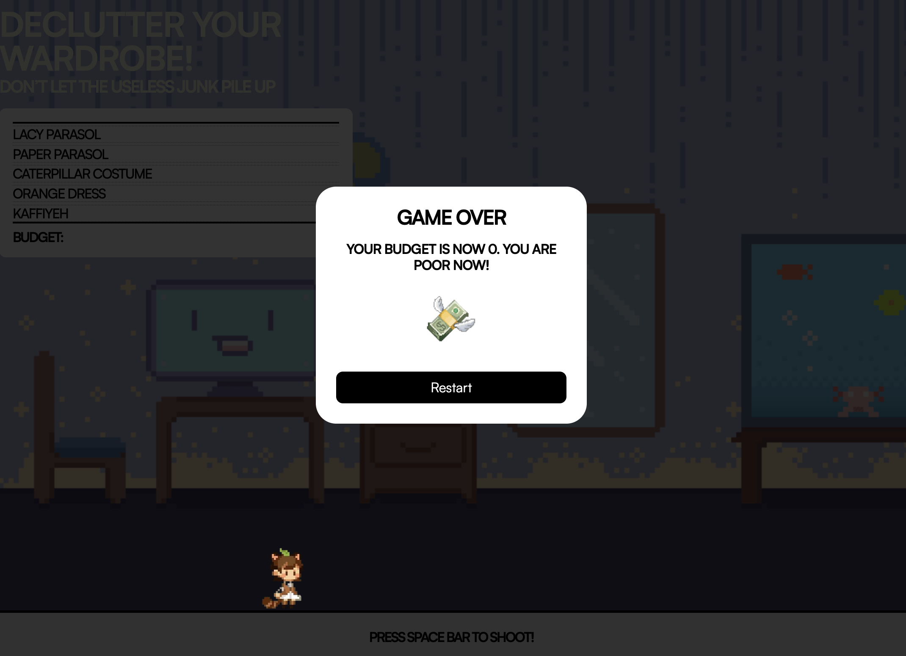

# Brief

Upgrade the **Assignment 02** by adding the use of data coming from an external web API. For example, fetch contents (audio, images, video, text, metadata) from online archives, AI generated contents (chatGPT API), data (weather, realtime traffic data, environmental data).

Have a look at the lesson about the API:

[https://wind-submarine-3d4.notion.site/Lesson-5-200d516637bc811aba69e13b0ffe438f?pvs=74](https://www.notion.so/Lesson-5-200d516637bc811aba69e13b0ffe438f?pvs=21)

The application **must** have those requirements:

- The webpage is responsive
- Use a web API (you choose which one best fists for your project) to load the data and display them in the webpage
- At least one multimedia file (for user feedback interactions, or content itself)
- Develop a navigation system that allows the user to navigate different sections with related content and functionalities

# Description 
I created a shooting game where an avatar shoots random objects that fall from the screen. The idea is to reflect on people’s spending habits when they buy useless things and make them more aware of how they spend money. I created a purchase-receipt–style header where, when an object falls to the ground, the receipt refreshes and shows that the user has made another useless purchase. When they run out of budget, the game is over. In the renewed version of assignment 3, I included a api from animal crossing called the Nookipedia API, I received an API key and used it in my code. 

# Flowchart

# List of Functions

### Background Music
- playMusic()
Plays the background music and loops it.

- pauseMusic()
Pauses the background music.

### Start Game / Falling Objects
- startSpawningObjects(): Creates falling objects by calling the createObject() and moveObject () function.
 - createObject () : uses an array from local file source to get the random object image and give a randome position on the y axis
 - moveObject () : let the object fall from outside the screen (y=-10), and returns the destroy state of the object

### Avatar

- moveLeft(): Moves the avatar left by decreasing X position, transform and flips the avatar by scaling x value

- moveRight(): Moves the avatar right by increasing X position and scale

- updateAvatarPosition(): make sure the avatar doesn't fall out of screen (avatar max x = 95)

- add event listener so the user can use keyboard arrow to control avatar position 

### Beam Shooting

- createBeam(): Creates the beam element (div) and sets its initial position.

- shootBeam(): Creates a beam, plays sound, and starts its movement.

- moveBeam(beam): Moves the beam upward until it disappears, checking collisions.

### Collision Detection

- checkCollision(beam, object): Checks if the beam and a falling object overlap.
 - uses .getBoundingClientRect to find the bounding box of beam and object

- destroyObject(beam): Removes an object on collision, plays sound, updates budget.

### Budget / Points Calculation

- loseBudget(): Deducts budget, adds item to list, checks for game over if budget is less than 0, add sound effect.

- gainBudget(): Adds money when an object is destroyed.

### ADD LIST

- getItem(): Returns a random item name from the item list array, there are 50 list of chatGPT generated list of random objects 

- addItem(): Adds the purchased item to the on-screen list (list-container)

### Game Over & Restart

- endGame(): Stops the game, shows end modal, resets objects, pauses music.

- restart button: Resets budget, hides modal, restarts falling objects.

# Final Result

